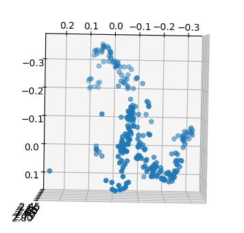

### computing points in 3D space from two 2D images

General Process:

- compute correspondance points
- translate points into homogenous coordinates
- normalize points
- compute essental matrix from normalized points
- generate transformations between camera poses
  - pose one is [I|0]
  - pose two is computed from the essental matrix
- use normalized points and camera transforms to triagulate the corresponding 3D points
- display points in 3D scatter plot

